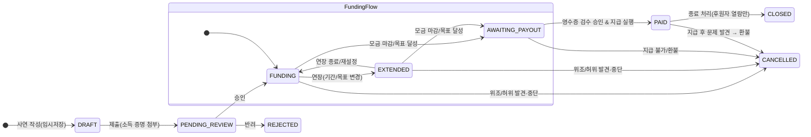
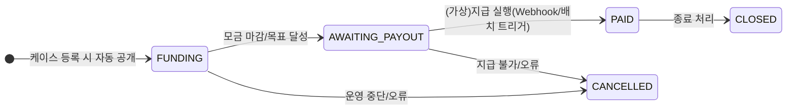

## 케이스 상태

### **1. 초기 단계**

- **DRAFT** (임시 저장)

  수혜자가 사연을 작성만 하고 아직 제출하지 않은 상태.

- **UNDER_REVIEW** (승인 대기)

  소득 증명 업로드 후, 관리자가 승인/반려를 기다리는 상태.

### **2. 모금 단계**

- **FUNDING** (모금 진행 중)

  관리자가 승인한 케이스 → 후원자 피드에 공개, 결제 가능.

- **EXTENDED** (모금 연장)

  목표 금액이나 기한 연장을 통해 FUNDING을 이어가는 상태.

### **3. 지급 단계**

- **AWAITING_PAYOUT** (지급 대기)

  모금이 마감되고, 영수증 검수 완료 후 실제 지급을 기다리는 상태.

- **PAID** (지급 완료)

  가상 지급 또는 실제 지급까지 끝난 상태.

### **4. 종료 및 예외**

- **CLOSED** (종료)

  모금 종료 + 지급 처리 완료 → 후원자 열람만 가능한 상태.

- **REJECTED** (승인 반려)

  소득 증명 위조/불충분으로 승인 불가.

- **CANCELLED** (취소/환불 연동)

  진행 중 문제가 발견되어 모금 중단 및 환불 프로세스 진행.

---

### **흐름 예시**

1. **DRAFT** → (제출) → **PENDING_REVIEW**
2. **PENDING_REVIEW** → (승인) → **FUNDING**
   - ↳ (반려) → **REJECTED**
3. **FUNDING** → (연장) → **EXTENDED**
4. **FUNDING/EXTENDED** → (마감) → **AWAITING_PAYOUT**
5. **AWAITING_PAYOUT** → (지급 완료) → **PAID**
6. **PAID** → (종료 처리) → **CLOSED**
7. 어느 단계든 문제 발생 시 → **CANCELLED**

---

### 1단계

**FUNDING → AWAITING_PAYOUT → PAID**

