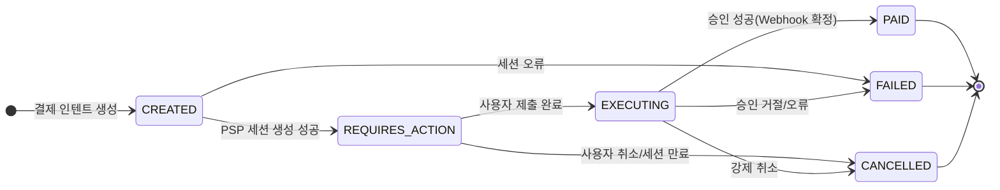
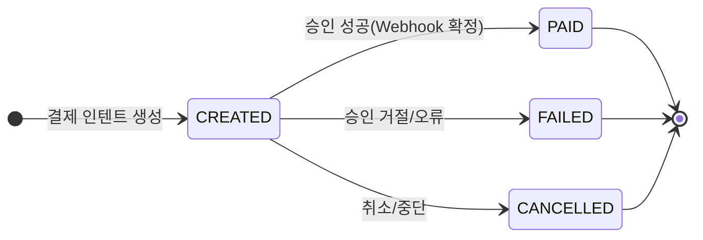

# 결제 상태 정의

## 1. 생성 단계

- **CREATED** (생성됨)
    - 결제 인텐트/세션이 생성된 상태
    - 아직 PG 결제창에서 결제 시도 전
    - 예: `POST /payments` 요청으로 row 생성

- **REQUIRES_ACTION** (사용자 액션 대기)
    - PSP 세션 생성 완료
    - 클라이언트가 JS SDK/HPP 창을 열고 사용자 입력/인증이 필요한 상태

---

## 2. 처리 단계

- **EXECUTING** (결제 진행 중)
    - 사용자가 입력/제출을 완료
    - PSP 승인/캡처가 진행 중
    - 최종 확정 대기 상태

---

## 3. 확정 단계

- **PAID** (결제 완료)
    - PSP 승인/캡처가 정상적으로 완료되어 결제가 확정된 상태
    - 기준: PSP 웹훅 이벤트 수신

---

## 4. 실패/취소 단계

- **FAILED** (결제 실패)
    - 카드 한도 초과, 인증 실패, PSP 오류 등으로 결제가 승인되지 못한 상태

- **CANCELLED** (취소됨)
    - 사용자가 결제창에서 취소했거나
    - 세션 만료/관리자가 강제로 취소한 상태

---

## 전이 규칙 요약

1. `CREATED → REQUIRES_ACTION` : PSP 세션(pg_payment_id) 생성 성공
2. `REQUIRES_ACTION → EXECUTING` : 클라이언트가 SDK에서 제출 완료
3. `EXECUTING → PAID` : 승인/캡처 성공 (웹훅 기준)
4. `EXECUTING → FAILED` : 승인 거절/오류
5. `REQUIRES_ACTION → CANCELLED` : 사용자 취소/세션 만료
6. 어느 단계든 운영자가 강제 취소 시 → `CANCELLED`

---

## 상태 전이 다이어그램

---

# 결제 상태 (1단계 MVP)

> 초기 구현은 단순하게 **CREATED → PAID / FAILED / CANCELLED**  
> (`REQUIRES_ACTION`, `EXECUTING`은 생략)

- **CREATED** (생성됨)
- **PAID** (결제 완료)
- **FAILED** (결제 실패)
- **CANCELLED** (취소됨)

---

## 흐름 예시 (MVP)

