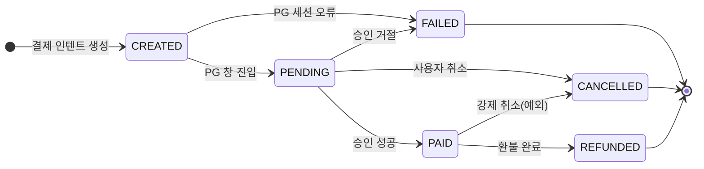
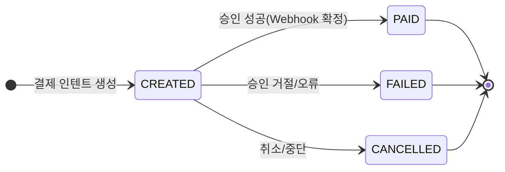

# 결제 상태

## **1. 생성 단계**

- **CREATED** (생성됨) 
  결제 인텐트/세션이 생성된 상태. 아직 PG 결제창에서 결제 시도 전
  (예: `POST /payments` 요청으로 row 생성)

- **PENDING** (승인 대기) 
  사용자가 PG 결제창에서 결제를 진행 중인 상태. 승인/거절 결과 대기

---

## **2. 확정 단계**

- **PAID** (결제 완료) 
  결제가 정상적으로 승인되고 확정된 상태 (웹훅 이벤트 수신 기준)

---

## **3. 실패/취소 단계**

- **FAILED** (결제 실패) 
  카드 한도 초과, 인증 실패, PG 오류 등으로 결제가 승인되지 못한 상태

- **CANCELLED** (취소됨)
  결제가 승인되기 전에 사용자가 취소했거나, 관리자가 강제로 취소한 상태

---

## **4. 환불 단계**

- **REFUNDED** (환불 완료)
  결제가 승인된 후, 환불까지 완료된 상태

---

## **흐름 예시**

1. **CREATED** → (결제창 진입) → **PENDING**  
2. **PENDING** → (승인 성공) → **PAID**  
   - ↳ (승인 거절) → **FAILED**  
   - ↳ (사용자 취소) → **CANCELLED**  
3. **PAID** → (환불 처리) → **REFUNDED**  
4. 어느 단계든 관리자가 강제 중단 시 → **CANCELLED**

---

# 결제 상태 (1단계 MVP)

> `CREATED → PAID/FAILED/CANCELLED` 
> (`PENDING`, `REFUNDED`는 생략)

- **CREATED** (생성됨) 
- **PAID** (결제 완료) 
- **FAILED** (결제 실패) 
- **CANCELLED** (취소됨)  

---

## **흐름 예시 (MVP)**

