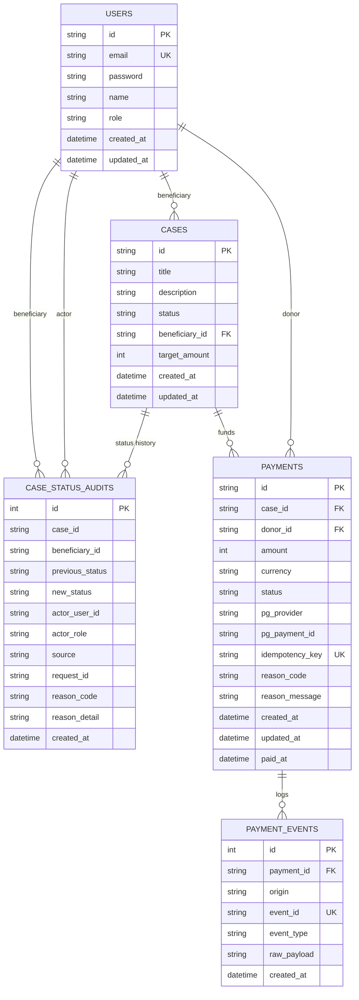

```mermaid
erDiagram
    USERS {
        string id PK
        string email UK
        string password
        string name
        string role
        datetime created_at
        datetime updated_at
    }

    CASES {
        string id PK
        string title
        string description
        string status
        string beneficiary_id FK
        int    target_amount
        datetime created_at
        datetime updated_at
    }

    CASE_STATUS_AUDITS {
        int    id PK
        string case_id
        string beneficiary_id
        string previous_status
        string new_status
        string actor_user_id
        string actor_role
        string source
        string request_id
        string reason_code
        string reason_detail
        datetime created_at
    }

    PAYMENTS {
        string id PK
        string case_id FK
        string donor_id FK
        int    amount
        string currency
        string status
        string pg_provider
        string pg_payment_id
        string idempotency_key UK
        string reason_code
        string reason_message
        datetime created_at
        datetime updated_at
        datetime paid_at
    }

    PAYMENT_EVENTS {
        int    id PK
        string payment_id FK
        string origin
        string event_id UK
        string event_type
        string raw_payload
        datetime created_at
    }

    %% 관계
    USERS   ||--o{ CASES              : "beneficiary"
    USERS   ||--o{ PAYMENTS           : "donor"
    CASES   ||--o{ PAYMENTS           : "funds"
    PAYMENTS||--o{ PAYMENT_EVENTS     : "logs"
    CASES   ||--o{ CASE_STATUS_AUDITS : "status history"
    USERS   ||--o{ CASE_STATUS_AUDITS : "actor"
    USERS   ||--o{ CASE_STATUS_AUDITS : "beneficiary"
```