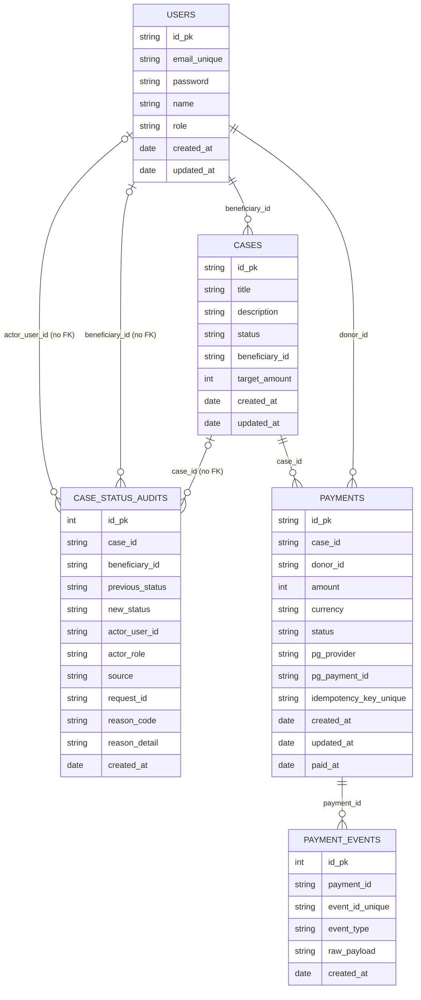

```mermaid
erDiagram
  USERS {
    string id_pk
    string email_unique
    string password
    string name
    string role
    date created_at
    date updated_at
  }

  CASES {
    string id_pk
    string title
    string description
    string status
    string beneficiary_id
    int target_amount
    date created_at
    date updated_at
  }

  CASE_STATUS_AUDITS {
    int id_pk
    string case_id
    string beneficiary_id
    string previous_status
    string new_status
    string actor_user_id
    string actor_role
    string source
    string request_id
    string reason_code
    string reason_detail
    date created_at
  }

  PAYMENTS {
    string id_pk
    string case_id
    string donor_id
    int amount
    string currency
    string status
    string pg_provider
    string pg_payment_id
    string idempotency_key_unique
    date created_at
    date updated_at
    date paid_at
  }

  PAYMENT_EVENTS {
    int id_pk
    string payment_id
    string event_id_unique
    string event_type
    string raw_payload
    date created_at
  }

  %% Relationships (actual FKs)
  USERS ||--o{ CASES : "beneficiary_id"
  USERS ||--o{ PAYMENTS : "donor_id"
  CASES ||--o{ PAYMENTS : "case_id"
  PAYMENTS ||--o{ PAYMENT_EVENTS : "payment_id"

  %% Conceptual (no FK enforced)
  CASES o|--o{ CASE_STATUS_AUDITS : "case_id (no FK)"
  USERS o|--o{ CASE_STATUS_AUDITS : "beneficiary_id (no FK)"
  USERS o|--o{ CASE_STATUS_AUDITS : "actor_user_id (no FK)"
```